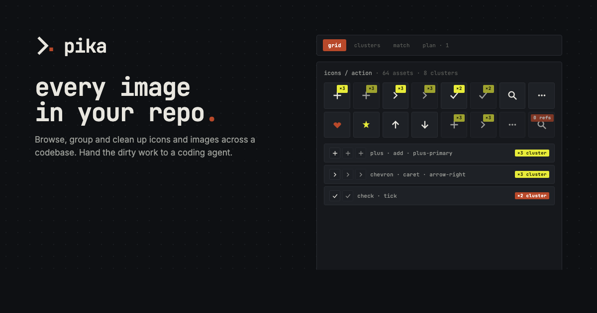
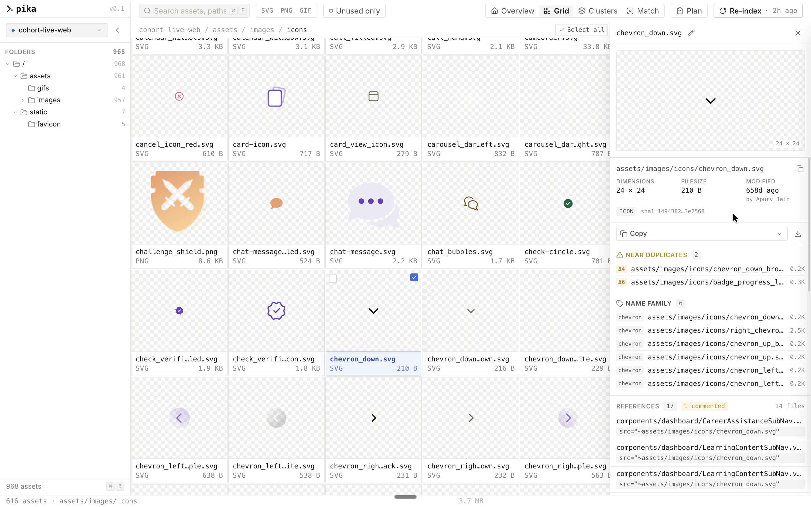
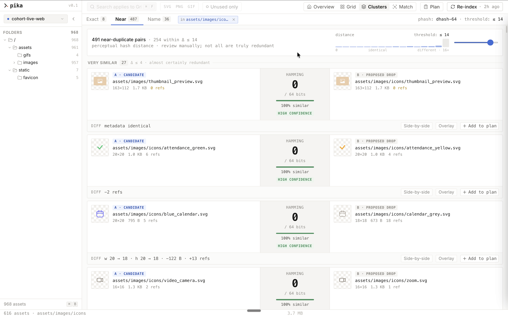
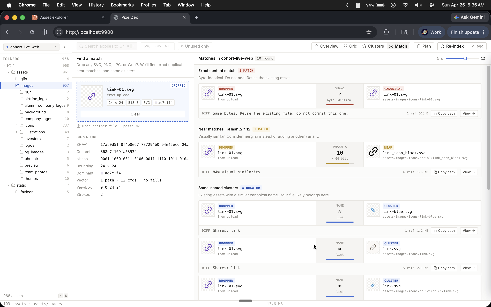
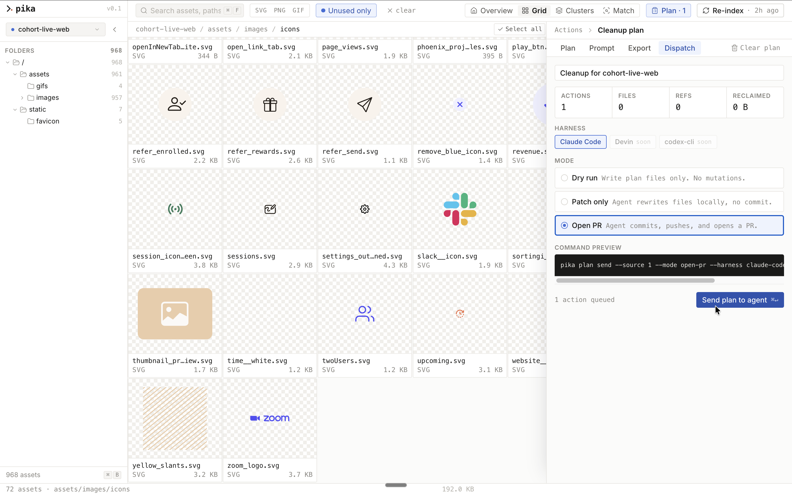

<p>
  
</p>

# pika

> Every image in your repo, in one place.

Pika points at a codebase and gives you a browsable surface for every
icon, illustration, and image inside it. It clusters duplicates and
near-duplicates by perceptual similarity, shows where each asset is
referenced across the source, and hands the cleanup plan to a coding
agent that opens a PR.

Local-first. Runs on your machine. Nothing is uploaded.

```
local-first · macos · linux · windows · MIT
```



---

## What it does

- **Scans** every image and icon under one or more local source roots.
- **Groups** by content hash, perceptual hash, optional CLIP embedding, and filename family.
- **Maps references** across your code and styles so you know what's safe to merge or delete.
- **Builds a cleanup plan** in the app: pick a canonical, queue the dupes, mark unused assets.
- **Hands off to an agent** (Claude Code today; Cursor, Codex, aider stubbed) which rewrites imports and opens a PR.

It's not a build tool, not a CDN, not a Figma plugin. It's the *map* of the asset surface that none of those give you.

## Quick start

Prerequisites: Node 24, [pnpm 10](https://pnpm.io). On macOS, if you have libvips installed via Homebrew, prefix `pnpm install` with `SHARP_IGNORE_GLOBAL_LIBVIPS=1`.

```sh
git clone https://github.com/chinmaykunkikar/pika.git
cd pika
pnpm install
pnpm db:migrate
pnpm pika source add /path/to/your/repo
pnpm pika index
pnpm dev
```

The app opens at `http://localhost:9900`. Add more sources from the sidebar at any time, or via the CLI.

## The three views

**Grid.** A high-density gallery of every image in the repo. Filter by folder, type, ref count, or search.

**Clusters.** Pika collapses look-alikes into a single row. The eleven logos you exported four times all live here, with the highest-resolution version recommended as canonical and an `UNUSED` flag on anything with zero references.



**Match.** Drop any image onto the window and pika tells you whether a near-match already exists in the codebase, before you commit a new one.



## Agent handoff

From the app, queue a set of merges and deletes into a cleanup plan. Pika emits a structured `plan.json` and a small CLI bridge hands it to your agent harness. The agent rewrites imports, deletes the redundant assets, and opens a PR. You stay in control of which clusters merge.



The wire format is plain JSON, easy to hand off to whichever harness you have set up:

```json
{
  "version": "pika/plan v1",
  "cluster": "logo-mark",
  "canonical": "public/logo.svg",
  "merge": [
    "src/components/Header/logo-mark.svg",
    "src/marketing/brand-logo.svg",
    "public/icons/logo@2x.png"
  ],
  "delete": ["archive/logo-old.svg"],
  "rewrite_imports": 24,
  "estimated_savings_kb": 112,
  "branch": "pika/dedupe-logo-mark"
}
```

## Stack

| | |
|---|---|
| Runtime | Node 24, pnpm 10 |
| App | Next 16 App Router, React 19, TypeScript strict |
| Styling | Tailwind CSS v4 (CSS-first config) + Radix Primitives + cmdk |
| Data | SQLite via better-sqlite3 with WAL, Drizzle ORM |
| Indexing | sharp (dims, raster, pHash), xxhash-wasm (content hash), optional CLIP embeddings |
| Search | SQLite FTS5 + Fuse.js |
| Lint/format | Biome (one tool) |

Architecture boundaries are strict: UI never imports from `lib/db/` or `lib/indexer/`; everything goes through `app/api/**` via TanStack Query. The indexer is the only writer (plus plan CRUD). See [`CLAUDE.md`](./CLAUDE.md) for the engineering rules and [`DESIGN.md`](./DESIGN.md) for the design system.

## Configuration

`pika.config.ts` at the repo root holds source roots, code/style scan paths, ignore globs, and harness settings:

```ts
import type { Config } from "./lib/config/schema";

const config: Config = {
  sources: [],
  codeRoots: ["./src", "./app", "./pages", "./layouts"],
  styleRoots: ["./assets/css", "./src/styles"],
  extensions: ["svg", "png", "jpg", "jpeg", "webp", "gif"],
  ignore: ["**/node_modules/**", "**/.next/**", "**/.nuxt/**", "**/dist/**"],
  dbPath: "./data/pika.db",
  phash: { enabled: true, maxHamming: 12 },
  clip: { enabled: false },
  usage: { maxHitsPerAsset: 50 },
  agent: {
    harnesses: { "claude-code": { bin: "claude", cwd: "./" } },
  },
};

export default config;
```

## Commands

```sh
pnpm dev                        # next dev on :9900
pnpm build && pnpm start        # production build
pnpm pika                       # CLI: source, index, status, match, plan
pnpm pika source add <path>
pnpm pika index [--full]
pnpm pika status
pnpm pika match <file>          # find near-matches for a file
pnpm db:generate                # drizzle-kit generate from schema diff
pnpm db:migrate                 # apply pending migrations
pnpm db:studio                  # web UI for the SQLite store
pnpm typecheck
pnpm lint
pnpm fmt
```

## Contributing

See [`CONTRIBUTING.md`](./CONTRIBUTING.md). The short version: TypeScript strict, Biome clean, no em-dashes, immutable data. Open issues and PRs against `master`.

## License

MIT. See [`LICENSE`](./LICENSE).
